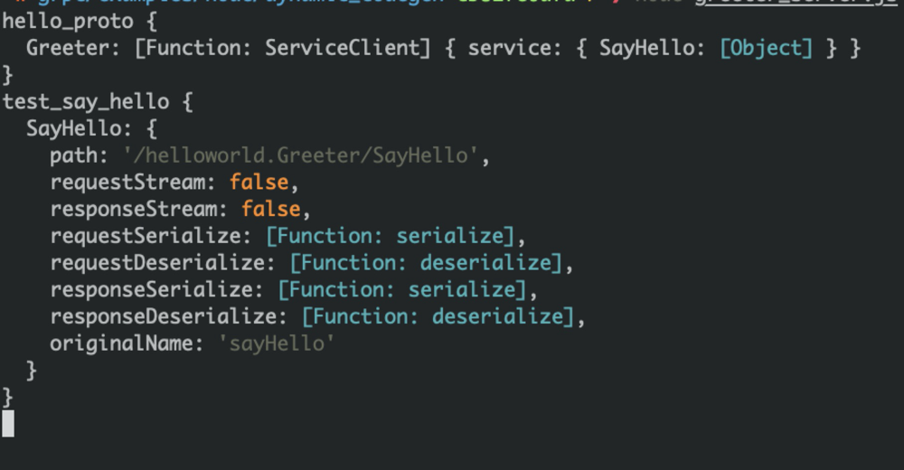

# rpc

rpc服务就是远程服务调用

### grpc及为什么用grpc

grpc是谷歌开源的一个rpc框架，grpc可以在不同语言和环境下进行通信和运行程序。

内容交换格式采用ProtoBuf(Google Protocol Buffers)，作用与XML，Json类似，但使用二进制，（反）序列化速度快，压缩效率高。

相对于http请求的优势

1、长连接，不需要三次握手，减少网络开销
2、有统一的注册中心，方便监控和统一管理
3、安全

简单来说成熟的rpc库相对http容器，更多的是封装了“服务发现”，"负载均衡"，“熔断降级”一类面向服务的高级特性。可以这么理解，rpc框架是面向服务的更高级的封装。如果把一个http servlet容器上封装一层服务发现和函数代理调用，那它就已经可以做一个rpc框架了。

那我们为什么不把所有的后端服务都换成grpc服务呢？因为开发复杂呀。。。。大多数简单的情况跟本用不到消耗这些成本。

### grpc用例分析

https://grpc.io/docs/languages/node/quickstart/

先写个简单的前后端通信样例吧

addService所注册的函数的第一个参数

会被传到call函数里

grpc服务分为四种类型

简单rpc

服务端流式rpc

客户端流式rpc

双向流式rpc

这里cp了一份服务端流式rpc的用例和客户端流式rpc的用例，如果有机会会把所有都补全

参考文章
[fong](https://juejin.im/post/5cd8ea15e51d453b696acc47)
[liaoxuefeng](https://www.bookstack.cn/read/grpc-v1.0/11.md)
[rpc与grpc](https://www.jianshu.com/p/959030de7f1c)
[grpc实战](https://segmentfault.com/a/1190000022298596)
[proto语法](https://www.jianshu.com/p/da7ed5914088)

